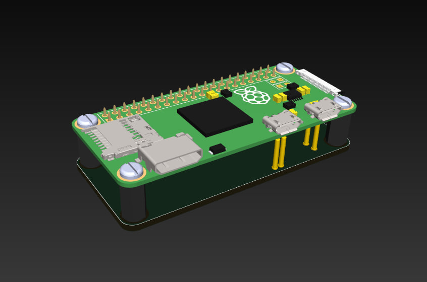
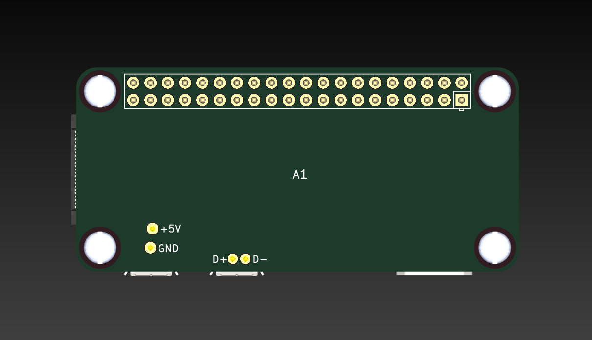
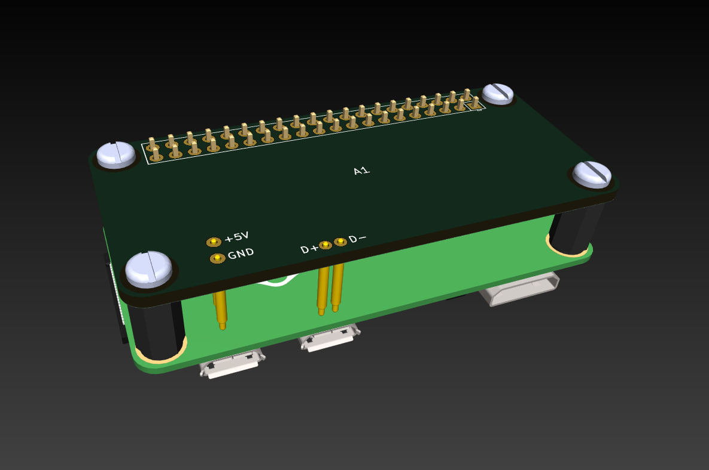

# Treddy treadmill-interface board

This is the **custom hardware** for the Precor 9.31 project: a Raspberry Pi
Zero 2 W hat that sits inline on the treadmill's RS-485 serial cable between
the console (Upper PCA) and motor controller (Lower PCA), so the Pi can
monitor, proxy, and emulate the controller (see the protocol writeup in
[`../../HARDWARE.md`](../../HARDWARE.md)).

**What's on the board:**

- **Dual RJ45** — `From Console` and `To Motor` (Amphenol 54602-x08
  horizontal). Pin 6 is cut through the Pi (intercept + proxy/emulate);
  pin 3 is tapped passively. Pinout/GPIO mapping is in
  [`../../HARDWARE.md`](../../HARDWARE.md) and `gpio.json`.
- **D24V10F5 buck** — Pololu 5 V 1 A step-down regulator off the
  treadmill's `+8V` rail, so the Pi is powered from the treadmill (no
  separate supply).
- **Pi Zero v1.3 hat footprint** — full 2×20 header so I²C/SPI/GPIO stay
  available; built on the pogo-pin PiZeroHat base (see *Upstream* below).

**In this directory:**

- `kicad/PiZeroHat.kicad_pro` / `.kicad_sch` / `.kicad_pcb` — the design
  (open `kicad/PiZeroHat.kicad_pro` in KiCad)
- `kicad/gerbers/` + `kicad/PiZeroHat-gerbers.zip` — fab-ready output
- `kicad/WIRING.md`, `kicad/WIRING-CHECKLIST.md`,
  `kicad/PERFBOARD-WIRING.{md,pdf,html}` — assembly / hand-wiring guides
  (a perfboard build is a valid alternative to fabbing the PCB)
- `lib/`, `kicad/Scott.pretty/`, `kicad/Scott.kicad_sym` — footprint /
  symbol libraries the design depends on

Per-user KiCad state, autosave backups, `fp-info-cache`, and editor
`.history` are intentionally **not** vendored (regenerable / machine-local).

---

## Upstream (vendored from vasya-zh/PiZeroHat)

The pogo-pin Pi-Zero-hat base is adapted from
**<https://github.com/vasya-zh/PiZeroHat>** (vendored as plain files — not a
submodule — so the design travels with this repo). Original README and BOM
preserved below for attribution and the pogo-pin/standoff hardware list.

# PiZeroHat

KiCad component and example project for creating Raspberry Pi Zero Shields/Hats with USB and power lines directly (nor with extra cables), with a help of pogo pins (spring contacts).

You can use it to create Pi Zero-based devices with onboard USB peripherals and advanced power circuits. For example USB-hubs and Ethernet drivers or other USB peripherals.

PiZeroHat KiCad library includes schematic symbols with D+, D- USB lines and +5V_USB and GND lines to power Raspberry Pi Zero properly, and a footprint with 2x20 RPi connector, pogo-pin's points and 2.75mm fixture holes for M2.5 stand-offs.

I've used a 10mm stand-off because of the 2x20 connector height. If you find a shorter connector, you can shorten the standoffs and use shorter pogo pins.

The goal was to make a PiZeroHat for cases then you need USB lines onboard with a complete 2x20 Pi connector to use also I2C, SPI and Pi GPIOs on your Hat.

Pogo pins will work with:
- Raspberry Pi Zero v1.3
- Raspberry Pi Zero W (see note below)
- Raspberry Pi Zero 2W (see note below)

> [!NOTE]
> PiZeroHat will work with Zero W and Zero 2W only if the ferrite ring is installed on D+ and D- pogo pins because of high WiFi radiation which affects on USB data transmission.

## BOM:
- 4pcs [CPG-01-TH-B](https://eu.mouser.com/ProductDetail/179-CPG-01-TH-B) - spring contacts or pogo pins for USB and power connections from CUI
- 4pcs [970100155](https://eu.mouser.com/ProductDetail/710-970100155) - 10mm M2.5 F-F Nylon stand-off from Wurth
- 8pcs [29331](https://eu.mouser.com/ProductDetail/534-29331) - M2.5x6mm nylon screws from Keystone
- 1pc [742701712](https://eu.mouser.com/ProductDetail/710-742701712) - ф9*/ф5mm*/H8mm ferrite ring - install on D+/D- pogo pins
- 1pc [2822](https://eu.mouser.com/ProductDetail/485-2822) - 2x20-pin Strip Dual Male Header from Adafruit
- 1pc [2243](https://eu.mouser.com/ProductDetail/485-2243) -  2x20 Short Female Header from Adafruit

You can use alternatives with the same dimensions from any manufacturer.
